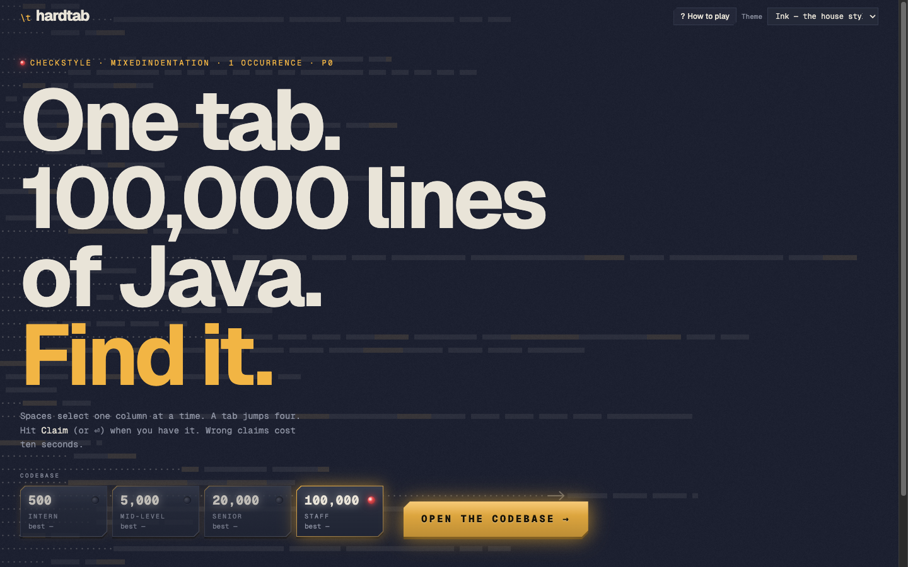
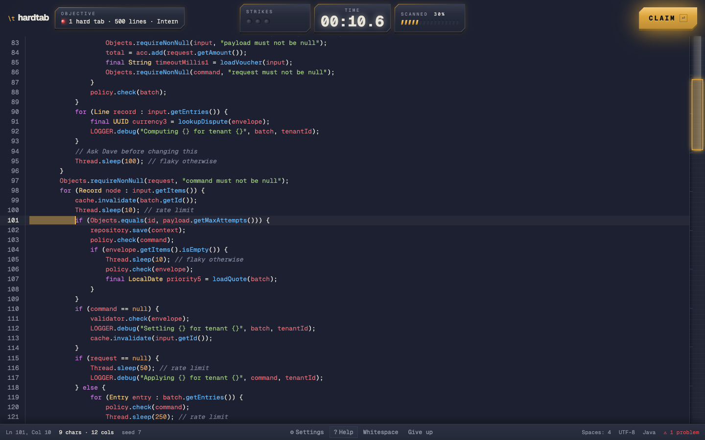
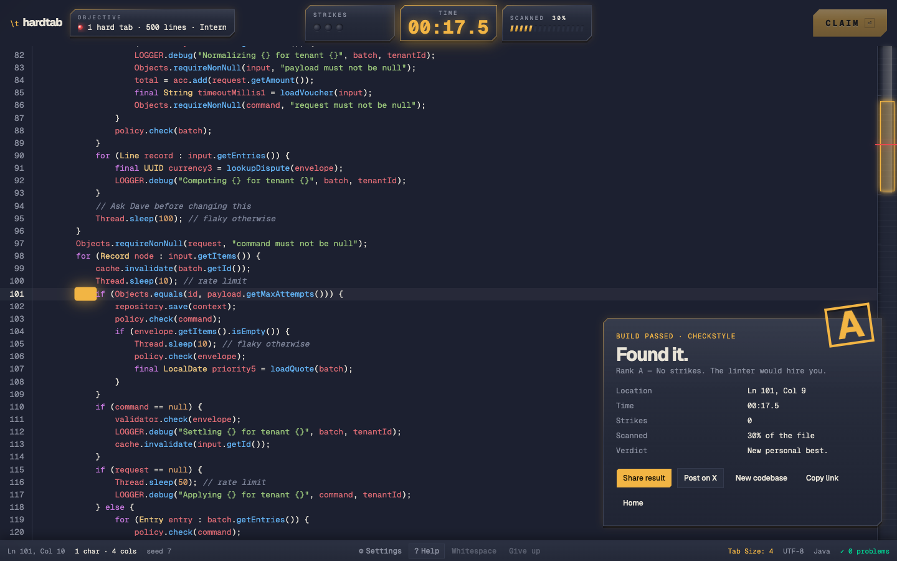
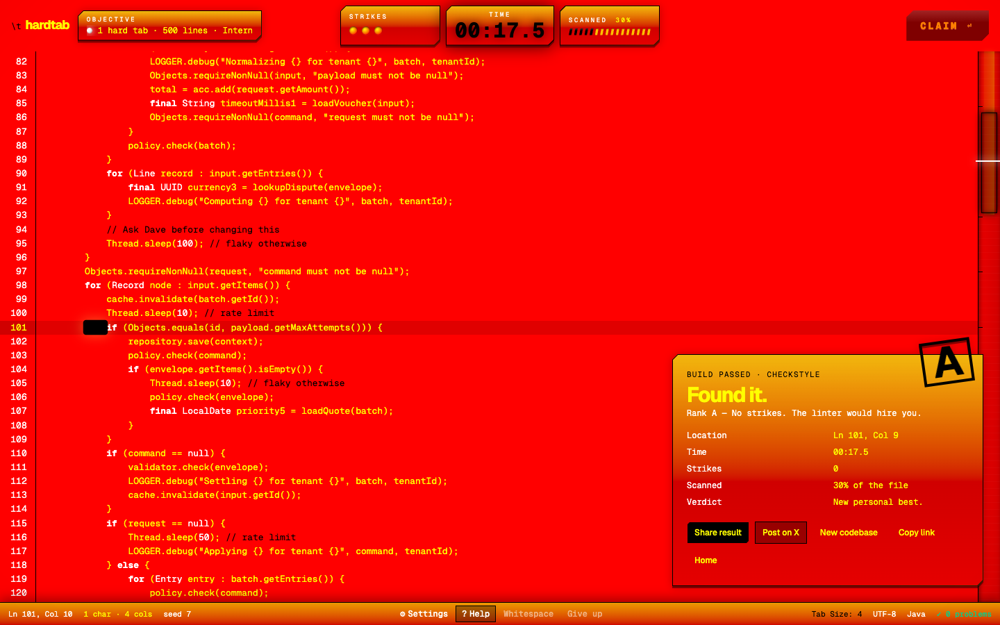

<h1 align="center"><code>\t</code> hardtab</h1>

<p align="center">
  Somewhere in 100,000 lines of Java, someone used a tab.<br />
  It looks exactly like four spaces. Find it.
</p>

<p align="center">
  <a href="https://hardtab.amanv.dev"><strong>▶ hardtab.amanv.dev</strong></a>
</p>



## How

Your cursor is the only tool. Spaces move it one column at a time; the tab throws it four. Put the caret next to the tab and hit **Claim**.

Wrong claims cost 10 seconds. Ctrl+F only sees what's on screen. Vim keys work — `/` doesn't.





Twelve themes, including one you'll regret.



## Run it

```sh
bun install
bun run dev:web    # http://localhost:3001
```

Built with [**Better-T-Stack**](https://better-t-stack.dev) — the whole project came from one command:

```sh
bun create better-t-stack@latest hardtab --frontend tanstack-router --backend none --database none --web-deploy cloudflare --package-manager bun
```

CodeMirror 6 · [vgpu](https://vgpu.sh) (WebGPU) · Cloudflare Workers via Alchemy · Geist · MIT
